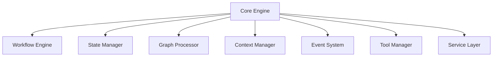
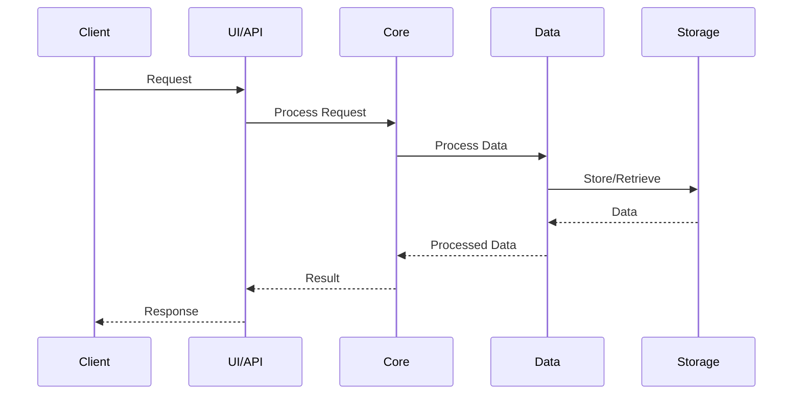

# NeuralFlow Architecture

## System Overview

NeuralFlow is built on a modular, event-driven architecture that enables flexible and scalable AI workflow management. The system is designed to handle complex AI operations while maintaining high performance and reliability.

## Core Components

### 1. Core Engine

The core engine (`src/core/`) is the heart of NeuralFlow, consisting of:
- Workflow engine (`workflow/`)
- State management (`state/`)
- Graph processing (`graph/`)
- Context management (`context/`)
- Event system (`events/`)
- Tool management (`tools/`)
- Service layer (`services/`)



### 2. Data Management

The data management system includes:
- Vector store (`src/vector_store/`)
- Graph store (`src/graph_store/`)
- Memory system (`src/memory/`)
- Storage system (`src/storage/`)
- Data processing (`src/data/`)

### 3. Infrastructure

The infrastructure layer (`src/infrastructure/`) provides:
- Configuration management
- Logging system
- Monitoring
- Deployment tools

### 4. UI Layer

The UI layer (`src/ui/`) provides:
- User interface components
- Visualization tools
- Interactive workflow builder

### 5. API Layer

The API layer (`src/api/`) provides:
- RESTful endpoints
- WebSocket support
- Authentication
- Rate limiting

## Data Flow



## Component Details

### Core Engine

The core engine provides:
- Workflow execution and management
- State persistence and management
- Graph-based data processing
- Context management
- Event-driven architecture
- Tool integration
- Service orchestration

### Data Management

The data management system includes:
- Vector store for embeddings and similarity search
- Graph store for relationship management
- Memory system for context and state
- Storage system for data persistence
- Data processing pipeline

### Infrastructure

The infrastructure layer provides:
- Configuration management
- Logging and monitoring
- Deployment tools
- Development environment setup

### UI Layer

The UI layer provides:
- Interactive workflow builder
- Visualization tools
- User interface components
- Real-time monitoring

### API Layer

The API layer provides:
- RESTful endpoints
- WebSocket support
- Authentication
- Rate limiting

## Security Architecture

### Authentication
- JWT-based authentication
- Role-based access control
- API key management

### Data Security
- End-to-end encryption
- Secure storage
- Data isolation

### Network Security
- TLS/SSL encryption
- Rate limiting
- DDoS protection

## Deployment Architecture

### Development Environment
- Local development setup
- Docker containers
- Development tools

### Production Environment
- Kubernetes cluster
- Load balancing
- Auto-scaling
- Monitoring

## Performance Considerations

### Caching Strategy
- Multi-level caching
- Cache invalidation
- Cache warming

### Scalability
- Horizontal scaling
- Load balancing
- Resource optimization

### Monitoring
- Metrics collection
- Logging
- Alerting

## Development Guidelines

### Code Organization
```
src/
├── api/              # API endpoints
├── config/           # Configuration management
├── core/             # Core functionality
│   ├── workflow/     # Workflow engine
│   ├── state/        # State management
│   ├── graph/        # Graph processing
│   ├── context/      # Context management
│   ├── events/       # Event system
│   ├── tools/        # Tool management
│   └── services/     # Service layer
├── data/             # Data processing
├── graph_store/      # Graph storage
├── infrastructure/   # Infrastructure components
├── logs/             # Logging system
├── memory/           # Memory management
├── models/           # Data models
├── neuralflow/       # Main package
├── services/         # Business services
├── storage/          # Storage system
├── ui/               # User interface
├── utils/            # Utility functions
└── vector_store/     # Vector storage
```

### Testing Strategy
- Unit tests
- Integration tests
- Performance tests
- Security tests

## Future Architecture

### Planned Improvements
- Enhanced workflow visualization
- Advanced monitoring
- Improved scaling
- Additional tool integrations

### Roadmap
1. Workflow optimization
2. Enhanced security features
3. Advanced analytics
4. Extended tool support

## Support

For architecture-related questions:
- Email: architecture@neuralflow.com
- Documentation: https://docs.neuralflow.com/architecture
- GitHub Issues: https://github.com/neuralflow/neuralflow/issues 