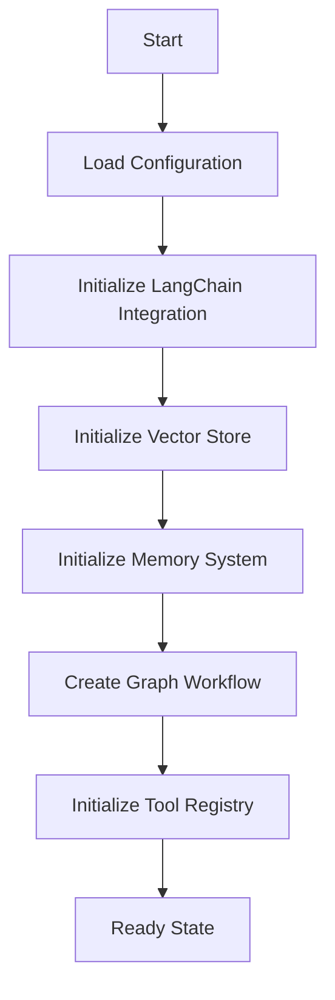
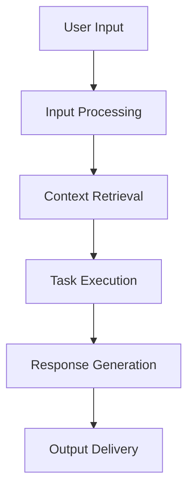
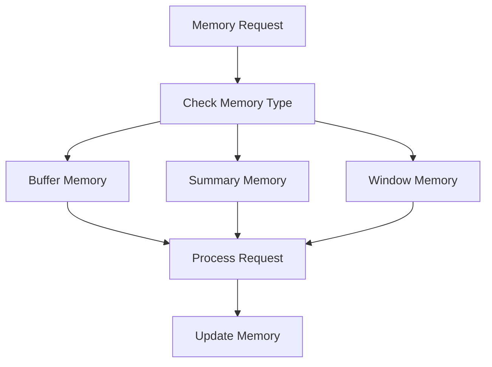

# LangGraph Workflow Orchestration - Technical Documentation

## System Architecture Overview

The system implements a sophisticated graph-based workflow management system that combines LangGraph's workflow capabilities with LangChain's rich ecosystem of LLM tools. The architecture is designed to be modular, extensible, and highly configurable.

### Core Components

1. **Graph Workflow Manager (`GraphWorkflowManager`)**
   - Central orchestrator for graph-based workflow execution
   - Manages state transitions and node execution
   - Handles error recovery and checkpointing
   - Integrates with LangChain components

2. **LangChain Integration Manager (`LangChainIntegrationManager`)**
   - Manages LangChain components and configurations
   - Handles LLM initialization and configuration
   - Manages memory systems and vector stores
   - Creates and configures chains and agents

3. **Tool Registry System (`ToolRegistry`)**
   - Provides a comprehensive set of tools for various tasks
   - Implements structured input validation
   - Manages tool execution and error handling
   - Supports extensibility for new tools

## Detailed System Flows

### 1. Workflow Initialization Flow



1. **Configuration Loading**
   - Load environment variables
   - Parse configuration files
   - Validate settings

2. **Component Initialization**
   - Initialize LangChain components
   - Set up vector stores
   - Configure memory systems
   - Create workflow graph

3. **Tool Setup**
   - Initialize available tools
   - Configure tool parameters
   - Set up error handling

### 2. Main Workflow Execution Flow



1. **Input Processing**
   - Validate user input
   - Initialize workflow state
   - Set up execution context

2. **Context Retrieval**
   - Search vector store
   - Retrieve relevant context
   - Process and filter context

3. **Task Execution**
   - Select appropriate tools
   - Execute tasks
   - Handle results

4. **Response Generation**
   - Format results
   - Generate final response
   - Update memory

### 3. Memory Management Flow



1. **Memory Types**
   - Buffer Memory: Stores raw conversation history
   - Summary Memory: Maintains summarized context
   - Window Memory: Keeps recent interactions

2. **Memory Operations**
   - Retrieval
   - Storage
   - Summarization
   - Cleanup

## Technical Implementation Details

### 1. State Management

```python
class GraphWorkflowState(BaseModel):
    user_query: str
    retrieved_context: Dict[str, Any]
    execution_result: Dict[str, Any]
    final_response: Optional[str]
    error: Optional[str]
    priority: int
    memory: List[Dict[str, Any]]
    thinking: List[str]
    conversation_id: Optional[str]
    context_processed: bool
    needs_more_context: bool
```

### 2. Tool Registry System

The system provides a comprehensive set of tools:

1. **Search Tools**
   - Vector store search
   - Web crawling
   - Google search integration
   - Wikipedia search

2. **Processing Tools**
   - Python REPL
   - HTTP requests
   - Calculator
   - SQL database operations

3. **QA Tools**
   - Context-based question answering
   - Knowledge base querying
   - Document processing

### 3. Chain Architecture

The system uses LangChain's LCEL (LangChain Expression Language) for chain composition:

```python
graph_workflow_chain = (
    RunnablePassthrough.assign(
        context=context_chain,
        task_result=task_chain
    )
    | response_chain
)
```

### 4. Agent System

The agent system is implemented using OpenAI's function calling:

```python
graph_agent = create_openai_functions_agent(
    llm=self.llm,
    tools=self.tool_registry.get_all_tools(),
    prompt=prompt
)
```

## Configuration System

### 1. LangChain Configuration

```python
class LangChainConfig(BaseModel):
    llm: LLMConfig
    memory: MemoryConfig
    vector_store: VectorStoreConfig
    document_loader: Optional[DocumentLoaderConfig]
```

### 2. Graph Workflow Configuration

```python
class GraphWorkflowConfig:
    max_context_items: int
    max_parallel_tasks: int
    response_format: str
    include_sources: bool
    include_metadata: bool
    execution_mode: str
    priority: int
    add_thinking: bool
    langchain_config: Optional[LangChainConfig]
    model_name: str
```

## Error Handling and Recovery

1. **Error Types**
   - Input validation errors
   - Tool execution errors
   - Memory operation errors
   - State transition errors

2. **Recovery Mechanisms**
   - Automatic retry for transient errors
   - State checkpointing
   - Graceful degradation
   - Error reporting and logging

## Performance Optimization

1. **Caching**
   - Vector store caching
   - Memory caching
   - Tool result caching

2. **Parallelization**
   - Parallel task execution
   - Concurrent memory operations
   - Async workflow execution

3. **Resource Management**
   - Memory usage optimization
   - Connection pooling
   - Rate limiting

## Security Considerations

1. **Authentication**
   - API key management
   - User authentication
   - Rate limiting

2. **Data Protection**
   - Input sanitization
   - Output validation
   - Secure storage

3. **Access Control**
   - Tool access restrictions
   - Resource limits
   - Permission management

## Monitoring and Logging

1. **Metrics Collection**
   - Performance metrics
   - Error rates
   - Usage statistics

2. **Logging System**
   - Structured logging
   - Log levels
   - Log rotation

3. **Alerting**
   - Error alerts
   - Performance alerts
   - Resource alerts

## Deployment and Scaling

1. **Deployment Options**
   - Local deployment
   - Container deployment
   - Cloud deployment

2. **Scaling Strategies**
   - Horizontal scaling
   - Vertical scaling
   - Load balancing

3. **Maintenance**
   - Backup procedures
   - Update process
   - Monitoring setup

## Future Enhancements

1. **Planned Features**
   - Additional tool integrations
   - Enhanced memory systems
   - Advanced workflow patterns

2. **Performance Improvements**
   - Caching optimizations
   - Parallel processing
   - Resource management

3. **Security Enhancements**
   - Advanced authentication
   - Data encryption
   - Access control 