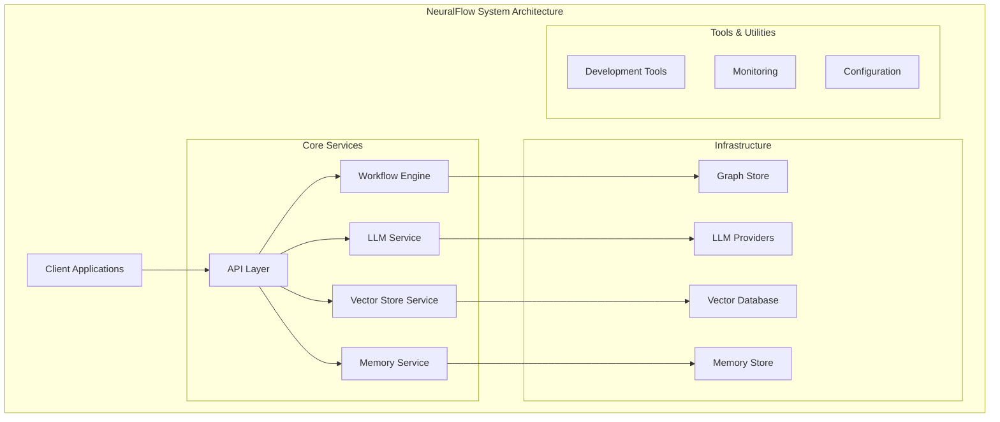
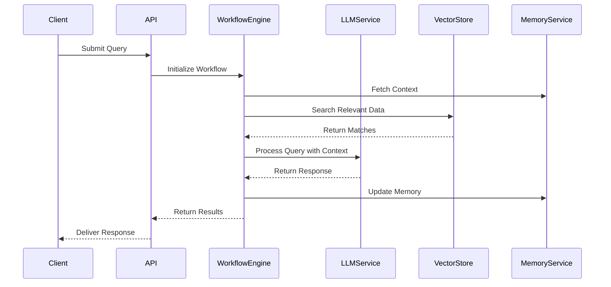

# System Architecture Overview

## High-Level Architecture

The NeuralFlow system is designed with a modular, scalable architecture that enables efficient AI workflow orchestration. Below is a detailed breakdown of the system architecture.

### System Components Diagram

## Core Components

### 1. API Layer
- RESTful API interface
- WebSocket support for real-time communication
- Authentication and authorization
- Rate limiting and request validation

### 2. Workflow Engine
- Dynamic workflow orchestration
- State management
- Error handling and recovery
- Parallel execution support

### 3. LLM Service
- Multiple LLM provider support
- Context window management
- Token optimization
- Response streaming

### 4. Vector Store Service
- Multiple backend support (FAISS, ChromaDB)
- Efficient indexing
- Batch processing
- Automatic reindexing

### 5. Memory Service
- Context tracking
- Token management
- Memory optimization
- Graph-based storage

## Infrastructure Components

### 1. Graph Store
- Relationship mapping
- Query optimization
- Graph traversal
- Data persistence

### 2. LLM Providers
- OpenAI integration
- Azure OpenAI integration
- Anthropic integration
- Custom model support

### 3. Vector Database
- FAISS implementation
- ChromaDB support
- Efficient vector storage
- Similarity search

### 4. Memory Store
- Redis backend
- Session management
- Caching layer
- State persistence

## System Interactions

### Request Flow Sequence

## System Requirements

### Hardware Requirements
- CPU: 4+ cores recommended
- RAM: 8GB minimum, 16GB recommended
- Storage: SSD with 20GB+ free space

### Software Requirements
- Python 3.8 or higher
- Redis 6.0 or higher
- Docker 20.10 or higher
- CUDA 11.0+ (for GPU support)

## Scalability

The system is designed to scale both vertically and horizontally:

### Vertical Scaling
- CPU/RAM upgrades
- GPU acceleration
- Storage expansion

### Horizontal Scaling
- Load balancing
- Service replication
- Distributed processing

## Future Architecture Considerations

### Planned Enhancements
1. Distributed workflow execution
2. Enhanced caching mechanisms
3. Multi-region support
4. Advanced monitoring and analytics

### Potential Integrations
1. Additional LLM providers
2. New vector store backends
3. Enhanced security features
4. Advanced analytics capabilities 