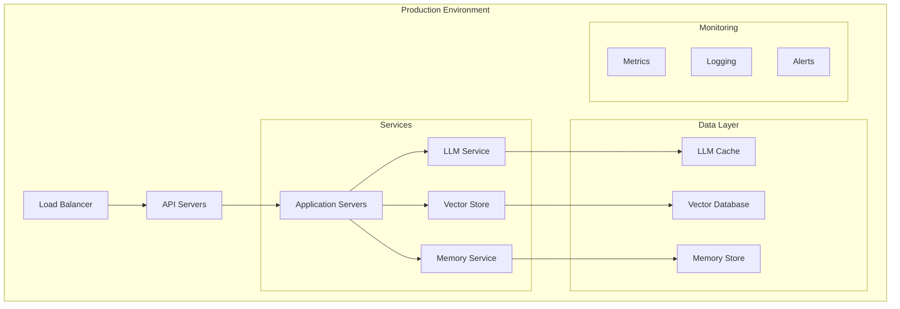

# Deployment Guide

This guide provides comprehensive instructions for deploying NeuralFlow in various environments.

## Deployment Architecture



## Prerequisites

### System Requirements
- CPU: 4+ cores recommended
- RAM: 8GB minimum, 16GB recommended
- Storage: SSD with 20GB+ free space
- Network: Stable internet connection

### Software Requirements
- Python 3.8 or higher
- Docker 20.10 or higher
- Kubernetes 1.20+ (for container orchestration)
- Redis 6.0 or higher
- PostgreSQL 13+ (optional)

## Local Development Setup

1. Clone the repository:
```bash
git clone https://github.com/yourusername/neuralflow.git
cd neuralflow
```

2. Create and activate virtual environment:
```bash
python -m venv .venv
source .venv/bin/activate  # Windows: .venv\Scripts\activate
```

3. Install dependencies:
```bash
pip install -r requirements.txt
pip install -r requirements-dev.txt
```

4. Set up environment variables:
```bash
cp .env.example .env
# Edit .env with your configuration
```

5. Run development server:
```bash
python main.py
```

## Docker Deployment

### Building the Docker Image

1. Build the image:
```bash
docker build -t neuralflow:latest .
```

2. Run the container:
```bash
docker run -d \
    --name neuralflow \
    -p 8000:8000 \
    -v $(pwd)/config:/app/config \
    --env-file .env \
    neuralflow:latest
```

### Docker Compose Setup

```yaml
version: '3.8'

services:
  api:
    build: .
    ports:
      - "8000:8000"
    environment:
      - REDIS_URL=redis://redis:6379
      - VECTOR_STORE_URL=vector-store:6333
    depends_on:
      - redis
      - vector-store

  redis:
    image: redis:6-alpine
    ports:
      - "6379:6379"
    volumes:
      - redis-data:/data

  vector-store:
    image: milvus/milvus:latest
    ports:
      - "6333:6333"
    volumes:
      - vector-store-data:/var/lib/milvus

volumes:
  redis-data:
  vector-store-data:
```

## Kubernetes Deployment

### Basic Deployment

1. Create namespace:
```bash
kubectl create namespace neuralflow
```

2. Deploy application:
```yaml
apiVersion: apps/v1
kind: Deployment
metadata:
  name: neuralflow
  namespace: neuralflow
spec:
  replicas: 3
  selector:
    matchLabels:
      app: neuralflow
  template:
    metadata:
      labels:
        app: neuralflow
    spec:
      containers:
      - name: neuralflow
        image: neuralflow:latest
        ports:
        - containerPort: 8000
        env:
        - name: REDIS_URL
          valueFrom:
            configMapKeyRef:
              name: neuralflow-config
              key: redis_url
        resources:
          requests:
            memory: "512Mi"
            cpu: "250m"
          limits:
            memory: "1Gi"
            cpu: "500m"
```

### Service Configuration

```yaml
apiVersion: v1
kind: Service
metadata:
  name: neuralflow-service
  namespace: neuralflow
spec:
  type: LoadBalancer
  ports:
  - port: 80
    targetPort: 8000
  selector:
    app: neuralflow
```

## Configuration Management

### Environment Variables

```bash
# API Configuration
API_HOST=0.0.0.0
API_PORT=8000
API_WORKERS=4

# LLM Configuration
LLM_PROVIDER=openai
LLM_MODEL=gpt-4
LLM_TEMPERATURE=0.7

# Vector Store Configuration
VECTOR_STORE_BACKEND=faiss
VECTOR_STORE_DIMENSION=1536
VECTOR_STORE_METRIC=cosine

# Memory Configuration
MEMORY_BACKEND=redis
MEMORY_TTL=3600
MEMORY_MAX_CONTEXTS=10
```

### Security Configuration

```yaml
security:
  # Authentication
  auth:
    jwt_secret: your-secret-key
    token_expiry: 3600
    
  # SSL/TLS
  ssl:
    enabled: true
    cert_path: /path/to/cert.pem
    key_path: /path/to/key.pem
    
  # Rate Limiting
  rate_limit:
    enabled: true
    requests_per_minute: 60
```

## Monitoring Setup

### Prometheus Configuration

```yaml
global:
  scrape_interval: 15s

scrape_configs:
  - job_name: 'neuralflow'
    static_configs:
      - targets: ['localhost:8000']
```

### Grafana Dashboard

```json
{
  "dashboard": {
    "id": null,
    "title": "NeuralFlow Metrics",
    "panels": [
      {
        "title": "Request Rate",
        "type": "graph",
        "datasource": "Prometheus",
        "targets": [
          {
            "expr": "rate(http_requests_total[5m])"
          }
        ]
      }
    ]
  }
}
```

## Scaling Considerations

### Horizontal Scaling

1. API Servers:
   - Use Kubernetes HPA
   - Configure based on CPU/Memory usage
   - Set appropriate replica counts

2. Vector Store:
   - Implement sharding
   - Configure read replicas
   - Optimize index distribution

3. Memory Store:
   - Redis cluster configuration
   - Implement cache sharding
   - Configure persistence

### Vertical Scaling

1. Resource Allocation:
   - Increase CPU/Memory limits
   - Optimize instance types
   - Monitor resource usage

2. Performance Tuning:
   - Adjust worker counts
   - Optimize batch sizes
   - Configure connection pools

## Backup and Recovery

### Backup Strategy

1. Database Backups:
```bash
# Vector store backup
milvus-backup -d /backup/vector-store

# Redis backup
redis-cli save
```

2. Configuration Backup:
```bash
# Backup Kubernetes configs
kubectl get all -n neuralflow -o yaml > backup/k8s-config.yaml

# Backup environment variables
cp .env backup/.env.backup
```

### Recovery Procedures

1. Service Recovery:
```bash
# Restore Kubernetes deployment
kubectl apply -f backup/k8s-config.yaml

# Restore Redis data
redis-cli restore
```

2. Data Recovery:
```bash
# Restore vector store
milvus-restore -f /backup/vector-store

# Verify data integrity
python scripts/verify_data.py
```

## Troubleshooting

### Common Issues

1. Connection Issues:
```bash
# Check service status
kubectl get pods -n neuralflow

# Check logs
kubectl logs -f deployment/neuralflow -n neuralflow
```

2. Performance Issues:
```bash
# Monitor resource usage
kubectl top pods -n neuralflow

# Check metrics
curl http://localhost:8000/metrics
```

### Health Checks

1. Service Health:
```bash
# API health check
curl http://localhost:8000/health

# Component health check
python scripts/health_check.py
```

2. Resource Monitoring:
```bash
# Monitor system resources
htop

# Monitor container resources
docker stats
```

## Security Considerations

### Network Security

1. Firewall Configuration:
```bash
# Allow API traffic
ufw allow 8000/tcp

# Allow monitoring
ufw allow 9090/tcp
```

2. SSL/TLS Setup:
```bash
# Generate certificate
openssl req -x509 -nodes -days 365 -newkey rsa:2048 \
    -keyout private.key -out certificate.crt

# Configure nginx
server {
    listen 443 ssl;
    ssl_certificate /path/to/certificate.crt;
    ssl_certificate_key /path/to/private.key;
}
```

### Access Control

1. API Authentication:
```python
@app.middleware("http")
async def authenticate(request: Request, call_next):
    token = request.headers.get("Authorization")
    if not token:
        raise HTTPException(status_code=401)
    # Validate token
    return await call_next(request)
```

2. Role-Based Access:
```python
@app.middleware("http")
async def check_permissions(request: Request, call_next):
    user = request.user
    if not user.has_permission(request.path):
        raise HTTPException(status_code=403)
    return await call_next(request)
```

## Maintenance Procedures

### Regular Maintenance

1. Update Dependencies:
```bash
# Update Python packages
pip install --upgrade -r requirements.txt

# Update Docker images
docker-compose pull
```

2. System Cleanup:
```bash
# Clean old logs
find /var/log/neuralflow -type f -mtime +30 -delete

# Clean Docker resources
docker system prune
```

### Performance Optimization

1. Cache Optimization:
```python
# Configure cache settings
cache_config = {
    "ttl": 3600,
    "max_size": "1GB",
    "eviction_policy": "LRU"
}
```

2. Database Optimization:
```sql
-- Optimize vector store
ANALYZE vector_table;
VACUUM ANALYZE;
```

## Monitoring and Alerts

### Metric Collection

1. System Metrics:
```python
# Collect system metrics
@app.get("/metrics")
async def metrics():
    return {
        "cpu_usage": get_cpu_usage(),
        "memory_usage": get_memory_usage(),
        "request_rate": get_request_rate()
    }
```

2. Application Metrics:
```python
# Track application metrics
@app.middleware("http")
async def track_metrics(request: Request, call_next):
    start_time = time.time()
    response = await call_next(request)
    duration = time.time() - start_time
    record_request_duration(duration)
    return response
```

### Alert Configuration

```yaml
alerting:
  rules:
    - alert: HighCPUUsage
      expr: cpu_usage > 80
      for: 5m
      labels:
        severity: warning
      annotations:
        description: "CPU usage is above 80%"

    - alert: HighMemoryUsage
      expr: memory_usage > 90
      for: 5m
      labels:
        severity: critical
      annotations:
        description: "Memory usage is above 90%"
``` 