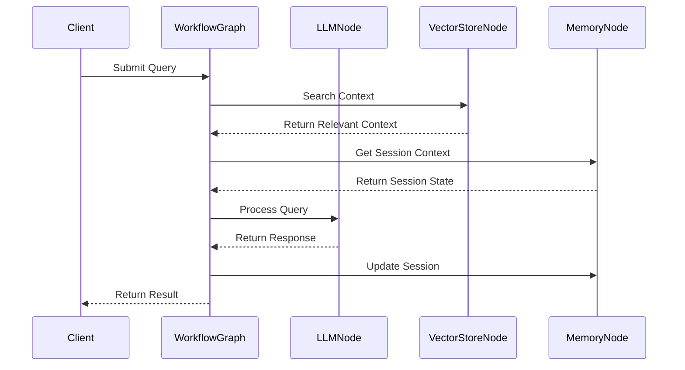
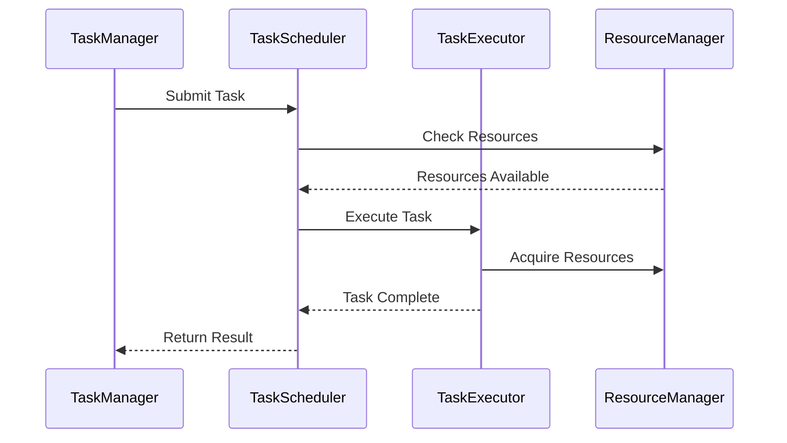
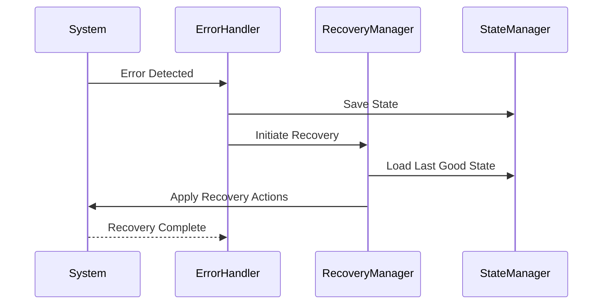

# Core Workflow Documentation

This document details the core workflows in the NeuralFlow system. These workflows form the backbone of the application's functionality.

## Main Application Workflow

### Purpose
The main application workflow orchestrates the overall flow of data and control in the NeuralFlow system, coordinating between different components and ensuring proper execution of tasks.

### Components
1. **WorkflowGraph**
   - Manages the overall workflow structure
   - Coordinates between different nodes
   - Handles state management

2. **WorkflowNodes**
   - LLMNode: Handles LLM interactions
   - VectorStoreNode: Manages vector operations
   - MemoryNode: Handles context management

3. **WorkflowExecutor**
   - Executes workflow steps
   - Manages error handling
   - Tracks execution state

### Flow Sequence



### Configuration

```yaml
workflow:
  graph:
    max_nodes: 100
    timeout_seconds: 30
    retry_attempts: 3
  
  executor:
    parallel_tasks: 5
    queue_size: 100
    monitoring: true
```

### Error Handling

1. **Node Failures**
   ```python
   try:
       await node.process()
   except NodeError as e:
       await self.handle_node_failure(e)
       await self.retry_or_fallback()
   ```

2. **Timeout Handling**
   ```python
   async with timeout(self.config.timeout_seconds):
       result = await self.execute_workflow()
   ```

3. **Recovery Procedures**
   - Automatic retry with exponential backoff
   - Fallback to simpler processing path
   - State persistence for recovery

## Task Orchestration Flow

### Purpose
Manages the execution of individual tasks within the workflow, ensuring proper sequencing and resource utilization.

### Components
1. **TaskScheduler**
   - Schedules task execution
   - Manages dependencies
   - Handles resource allocation

2. **TaskExecutor**
   - Executes individual tasks
   - Manages task lifecycle
   - Handles task-specific errors

### Flow Sequence



### Configuration

```yaml
task_orchestration:
  scheduler:
    max_concurrent_tasks: 10
    queue_size: 1000
    priority_levels: 3
  
  executor:
    timeout_seconds: 60
    retry_attempts: 3
    monitoring_interval: 5
```

### Error Handling

1. **Resource Allocation**
   ```python
   async def allocate_resources(self, task: Task) -> Resources:
       try:
           return await self.resource_manager.allocate(task.requirements)
       except ResourceError:
           await self.handle_resource_failure()
   ```

2. **Task Execution**
   ```python
   async def execute_task(self, task: Task) -> Result:
       for attempt in range(self.config.retry_attempts):
           try:
               return await self._execute(task)
           except TaskError as e:
               await self.handle_task_error(e, attempt)
   ```

## Error Handling and Recovery Flow

### Purpose
Provides systematic error handling and recovery mechanisms across the system.

### Components
1. **ErrorHandler**
   - Detects and categorizes errors
   - Implements recovery strategies
   - Manages error reporting

2. **RecoveryManager**
   - Implements recovery procedures
   - Manages system state during recovery
   - Coordinates recovery actions

### Flow Sequence



### Configuration

```yaml
error_handling:
  handler:
    log_level: INFO
    notification_threshold: ERROR
    max_retries: 3
  
  recovery:
    state_persistence: true
    automatic_recovery: true
    recovery_timeout: 300
```

### Recovery Procedures

1. **State Recovery**
   ```python
   async def recover_state(self) -> bool:
       last_good_state = await self.state_manager.get_last_good()
       return await self.system.restore_state(last_good_state)
   ```

2. **Graceful Degradation**
   ```python
   async def degrade_service(self, error: SystemError) -> None:
       affected_components = await self.analyze_impact(error)
       await self.disable_components(affected_components)
       await self.notify_monitoring(DegradedState(affected_components))
   ```

## Best Practices

1. **Workflow Design**
   - Keep workflows modular and composable
   - Implement proper error handling at each step
   - Maintain clear documentation
   - Use type hints and validation

2. **Task Management**
   - Implement proper resource management
   - Use appropriate timeout values
   - Monitor task execution
   - Implement retry mechanisms

3. **Error Handling**
   - Log errors appropriately
   - Implement proper recovery mechanisms
   - Maintain system state during recovery
   - Notify appropriate parties

## Testing Guidelines

1. **Unit Tests**
   ```python
   async def test_workflow_execution():
       workflow = TestWorkflow()
       result = await workflow.execute(test_input)
       assert result.status == Status.SUCCESS
   ```

2. **Integration Tests**
   ```python
   async def test_end_to_end_flow():
       system = TestSystem()
       await system.initialize()
       result = await system.process_request(test_request)
       assert result.is_valid()
   ```

## Monitoring and Metrics

1. **Performance Metrics**
   - Workflow execution time
   - Task success/failure rates
   - Resource utilization
   - Error rates and types

2. **Health Checks**
   ```python
   async def check_system_health(self) -> HealthStatus:
       component_status = await self.check_components()
       resource_status = await self.check_resources()
       return HealthStatus(component_status, resource_status)
   ```

## Security Considerations

1. **Input Validation**
   ```python
   async def validate_workflow_input(self, input_data: Dict) -> bool:
       validator = InputValidator(self.schema)
       return await validator.validate(input_data)
   ```

2. **Access Control**
   ```python
   async def check_permissions(self, user: User, workflow: Workflow) -> bool:
       return await self.auth_manager.has_permission(user, workflow.required_permissions)
   ```

## Deployment Considerations

1. **Configuration Management**
   - Use environment-specific configurations
   - Validate configurations before deployment
   - Maintain configuration version control

2. **Scaling**
   - Design for horizontal scaling
   - Implement proper load balancing
   - Monitor resource utilization

## Contributing

When contributing to core workflows:

1. Follow the established patterns
2. Update documentation
3. Add appropriate tests
4. Consider backward compatibility
5. Review security implications 