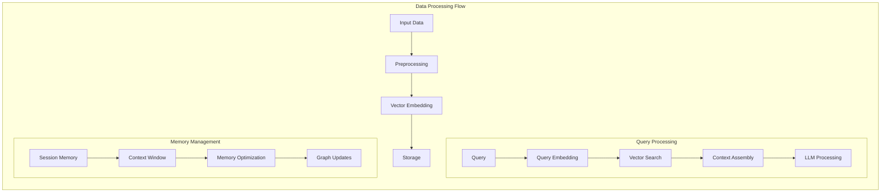
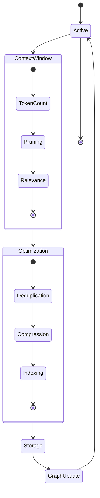

# Data Flows

This document describes the various data flows within the NeuralFlow system, including data processing, query handling, and memory management.

## Data Processing Flow



## Input Processing Flow

### 1. Data Ingestion
- Document parsing
- Text extraction
- Metadata processing
- Format validation

### 2. Preprocessing
- Text normalization
- Token splitting
- Feature extraction
- Quality checks

### 3. Vector Embedding
- Model selection
- Embedding generation
- Dimension reduction (if needed)
- Quality validation

### 4. Storage
- Vector indexing
- Metadata storage
- Relationship mapping
- Index optimization

## Query Processing Flow

### 1. Query Analysis
- Intent detection
- Parameter extraction
- Context identification
- Priority assignment

### 2. Vector Search
- Query embedding
- Similarity search
- Result ranking
- Relevance scoring

### 3. Context Assembly
- Context window management
- Token budget allocation
- Priority-based filtering
- Context optimization

### 4. LLM Processing
- Prompt construction
- Context injection
- Response generation
- Output validation

## Memory Management Flow



### 1. Session Management
- Session initialization
- State tracking
- Context preservation
- Session cleanup

### 2. Context Window Management
- Token counting
- Window sliding
- Priority management
- Relevance scoring

### 3. Memory Optimization
- Deduplication
- Compression
- Indexing
- Cache management

### 4. Graph Updates
- Relationship detection
- Graph construction
- Edge weighting
- Pruning

## Error Handling Flow

### 1. Error Detection
- Input validation
- Process monitoring
- Resource checking
- Timeout management

### 2. Error Recovery
- State restoration
- Retry logic
- Fallback mechanisms
- Error logging

### 3. Error Reporting
- Error classification
- Notification
- Metrics update
- Documentation

## Performance Optimization

### 1. Caching Strategy
- Result caching
- Embedding caching
- Context caching
- Cache invalidation

### 2. Batch Processing
- Request batching
- Embedding batching
- Storage optimization
- Bulk operations

### 3. Resource Management
- Connection pooling
- Thread management
- Memory allocation
- Resource cleanup

## Implementation Examples

### Query Processing Implementation
```python
class QueryProcessor:
    async def process_query(
        self,
        query: str,
        context: Optional[Dict] = None
    ) -> QueryResult:
        # Query analysis
        analyzed_query = await self.analyze_query(query)
        
        # Vector search
        relevant_vectors = await self.vector_search(analyzed_query)
        
        # Context assembly
        context = await self.assemble_context(
            relevant_vectors,
            context
        )
        
        # LLM processing
        return await self.llm_process(analyzed_query, context)
```

### Memory Management Implementation
```python
class MemoryManager:
    async def optimize_context(
        self,
        context: Context,
        max_tokens: int
    ) -> OptimizedContext:
        # Token counting
        current_tokens = await self.count_tokens(context)
        
        # Pruning if needed
        if current_tokens > max_tokens:
            context = await self.prune_context(
                context,
                max_tokens
            )
        
        # Optimize remaining context
        optimized = await self.optimize(context)
        
        # Update graph
        await self.update_graph(optimized)
        
        return optimized
```

## Best Practices

### 1. Data Processing
- Validate input data early
- Implement proper error handling
- Use appropriate batch sizes
- Monitor processing metrics

### 2. Memory Management
- Implement efficient pruning strategies
- Use appropriate caching mechanisms
- Regular optimization runs
- Monitor memory usage

### 3. Error Handling
- Implement comprehensive error handling
- Use appropriate retry strategies
- Maintain detailed error logs
- Regular error analysis

### 4. Performance
- Regular performance monitoring
- Optimize resource usage
- Implement appropriate caching
- Regular performance testing 