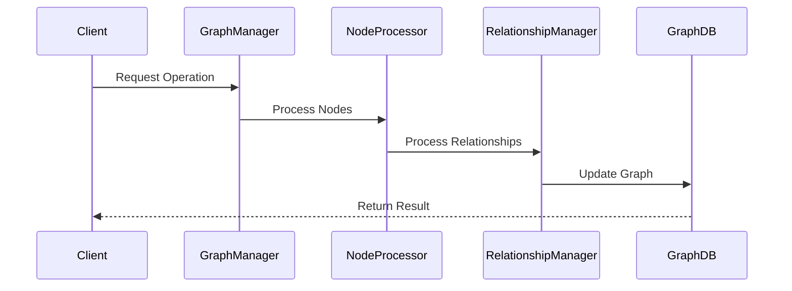
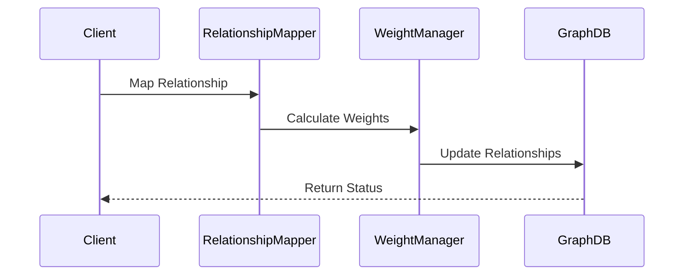
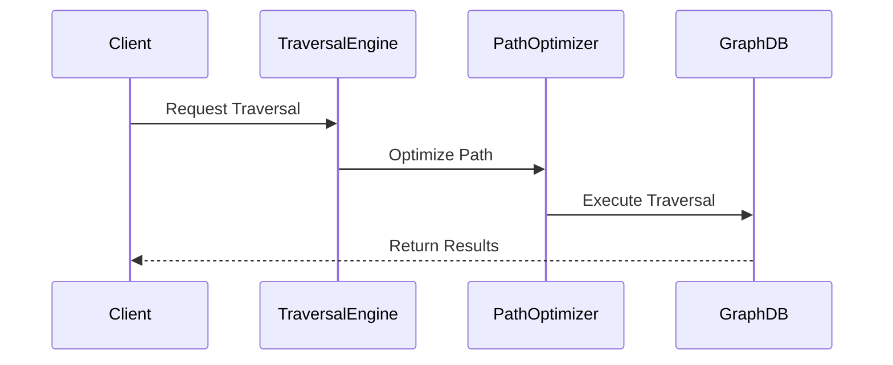

# Graph Processing Flows

This document details the flows related to graph processing in the NeuralFlow system.

## Knowledge Graph Operations Flow

### Purpose
Manages operations on the knowledge graph, including node creation, relationship management, and graph traversal.

### Components
1. **GraphManager**
   - Manages graph operations
   - Handles node management
   - Manages relationships

2. **NodeProcessor**
   - Processes graph nodes
   - Handles node attributes
   - Manages node states

3. **RelationshipManager**
   - Manages relationships
   - Handles edge attributes
   - Processes edge weights

### Flow Sequence



### Configuration

```yaml
graph_processing:
  graph_manager:
    max_nodes: 1000000
    max_relationships: 5000000
    batch_size: 1000
  
  node_processor:
    attribute_limit: 100
    index_fields: ["name", "type", "created_at"]
    cache_size: 10000
  
  relationship_manager:
    max_weight: 1.0
    weight_decay: 0.1
    prune_threshold: 0.1
```

## Relationship Mapping Flow

### Purpose
Handles the mapping and management of relationships between nodes in the knowledge graph.

### Components
1. **RelationshipMapper**
   - Maps node relationships
   - Handles relationship types
   - Manages relationship weights

2. **WeightManager**
   - Manages edge weights
   - Handles weight updates
   - Processes weight calculations

### Flow Sequence



### Implementation

```python
class RelationshipMapper:
    async def map_relationship(
        self,
        source: Node,
        target: Node,
        relationship_type: str
    ) -> Relationship:
        """
        Maps relationship between nodes.
        """
        # Validate relationship
        if not await self.validate_relationship(source, target):
            raise InvalidRelationshipError()
        
        # Calculate weight
        weight = await self.weight_manager.calculate_weight(
            source,
            target,
            relationship_type
        )
        
        # Create relationship
        return await self.create_relationship(
            source,
            target,
            relationship_type,
            weight
        )
```

## Graph Traversal Flow

### Purpose
Manages graph traversal operations for querying and analyzing the knowledge graph.

### Components
1. **TraversalEngine**
   - Handles graph traversal
   - Manages traversal paths
   - Optimizes traversal

2. **PathOptimizer**
   - Optimizes traversal paths
   - Handles path costs
   - Manages path selection

### Flow Sequence



### Implementation

```python
class GraphTraversal:
    async def traverse_graph(
        self,
        start_node: Node,
        query: TraversalQuery
    ) -> TraversalResult:
        """
        Executes graph traversal operation.
        """
        # Optimize query
        optimized_query = await self.optimize_query(query)
        
        # Execute traversal
        path = await self.find_path(start_node, optimized_query)
        
        # Process results
        return await self.process_results(path)
```

## Error Handling

### 1. Graph Errors

```python
async def handle_graph_error(
    self,
    error: GraphError
) -> GraphResult:
    """
    Handles errors in graph operations.
    """
    if isinstance(error, NodeError):
        return await self.handle_node_error(error)
    elif isinstance(error, RelationshipError):
        return await self.handle_relationship_error(error)
    return ErrorResult(str(error))
```

### 2. Traversal Errors

```python
async def handle_traversal_error(
    self,
    error: TraversalError
) -> TraversalResult:
    """
    Handles errors during graph traversal.
    """
    if isinstance(error, PathNotFoundError):
        return await self.handle_path_error(error)
    elif isinstance(error, CycleDetectedError):
        return await self.handle_cycle_error(error)
    return ErrorResult(str(error))
```

## Performance Optimization

### 1. Query Optimization

```python
class QueryOptimizer:
    async def optimize_query(
        self,
        query: GraphQuery
    ) -> OptimizedQuery:
        """
        Optimizes graph query for performance.
        """
        # Analyze query
        analysis = await self.analyze_query(query)
        
        # Apply optimizations
        optimized = await self.apply_optimizations(
            query,
            analysis
        )
        
        return optimized
```

### 2. Path Optimization

```python
class PathOptimizer:
    async def optimize_path(
        self,
        path: Path,
        constraints: Constraints
    ) -> OptimizedPath:
        """
        Optimizes traversal path.
        """
        # Calculate costs
        costs = await self.calculate_path_costs(path)
        
        # Apply optimizations
        return await self.optimize_with_constraints(
            path,
            costs,
            constraints
        )
```

## Monitoring and Metrics

### 1. Graph Metrics

```python
class GraphMetrics:
    async def record_graph_metrics(self):
        """
        Records graph-related metrics.
        """
        metrics = {
            'node_count': await self.count_nodes(),
            'relationship_count': await self.count_relationships(),
            'average_degree': await self.calculate_avg_degree()
        }
        await self.metrics_client.record(metrics)
```

### 2. Performance Monitoring

```python
class GraphPerformanceMonitor:
    async def monitor_operation(
        self,
        operation: GraphOperation
    ):
        """
        Monitors graph operation performance.
        """
        metrics = {
            'operation_type': operation.type,
            'duration': operation.duration,
            'nodes_affected': operation.node_count,
            'relationships_affected': operation.relationship_count
        }
        await self.monitor.record(metrics)
```

## Security Considerations

### 1. Access Control

```python
class GraphAccess:
    async def check_access(
        self,
        user: User,
        operation: GraphOperation
    ) -> bool:
        """
        Checks access permissions for graph operations.
        """
        return await self.auth_manager.has_permission(
            user,
            operation.required_permissions
        )
```

### 2. Data Protection

```python
class GraphProtection:
    async def protect_sensitive_data(
        self,
        node: Node
    ) -> Node:
        """
        Protects sensitive data in graph nodes.
        """
        # Identify sensitive attributes
        sensitive = await self.identify_sensitive_attributes(node)
        
        # Apply protection
        return await self.apply_protection(node, sensitive)
```

## Best Practices

1. **Graph Operations**
   - Validate operations
   - Optimize queries
   - Manage transactions
   - Handle concurrency

2. **Relationship Management**
   - Validate relationships
   - Manage weights properly
   - Handle bidirectional relationships
   - Maintain consistency

3. **Traversal**
   - Optimize paths
   - Handle cycles
   - Manage memory usage
   - Cache common paths

4. **Security**
   - Implement access control
   - Protect sensitive data
   - Audit operations
   - Validate inputs

## Testing Guidelines

### 1. Unit Tests

```python
async def test_graph_operations():
    manager = GraphManager()
    result = await manager.create_node(test_data)
    assert result.status == Status.SUCCESS
    assert result.node.id is not None
```

### 2. Integration Tests

```python
async def test_graph_traversal():
    traversal = GraphTraversal()
    path = await traversal.find_path(start_node, end_node)
    assert path.is_valid()
    assert len(path) <= max_path_length
```

## Contributing

When contributing to graph processing:

1. Follow optimization guidelines
2. Update documentation
3. Add appropriate tests
4. Consider security implications
5. Update monitoring metrics 