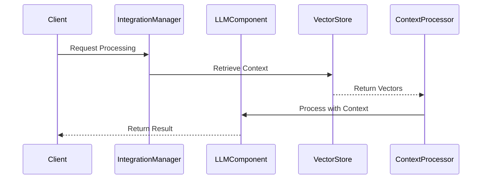
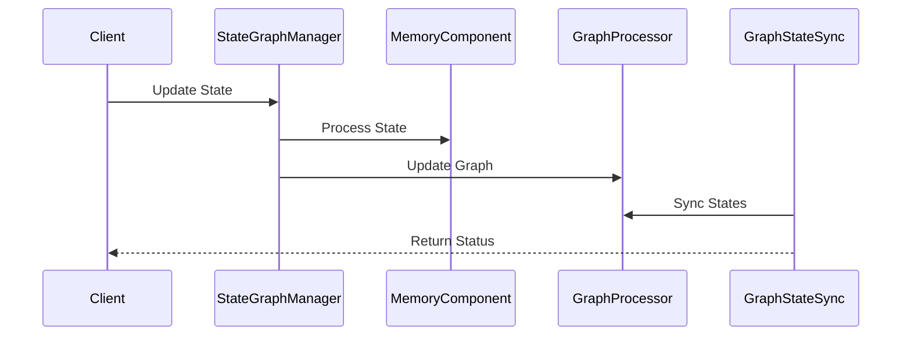
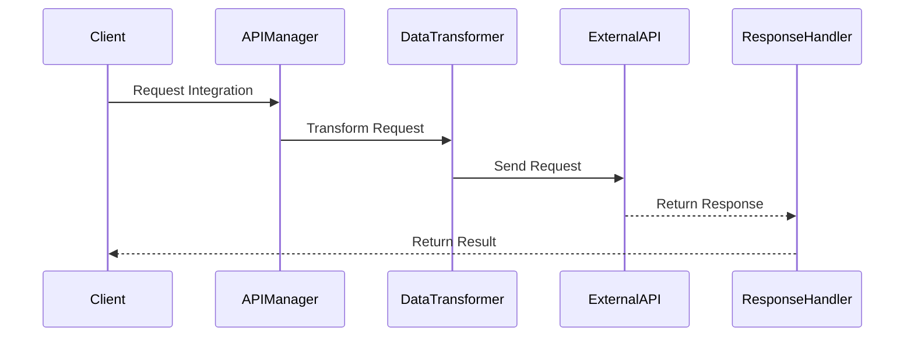

# Integration Flows

This document details the integration flows between different components in the NeuralFlow system.

## LLM-Vector Store Integration Flow

### Purpose
Manages the integration between LLM components and vector stores, enabling efficient context retrieval and processing.

### Components
1. **IntegrationManager**
   - Manages component integration
   - Handles data flow
   - Coordinates operations

2. **ContextProcessor**
   - Processes context data
   - Manages context retrieval
   - Handles context optimization

### Flow Sequence



### Configuration

```yaml
llm_vector_integration:
  integration_manager:
    batch_size: 32
    timeout_seconds: 30
    retry_attempts: 3
  
  context_processor:
    max_context_length: 4096
    relevance_threshold: 0.7
    cache_size: 1000
```

## Memory-Graph Integration Flow

### Purpose
Handles the integration between memory management and graph processing components.

### Components
1. **StateGraphManager**
   - Manages state representation
   - Handles graph updates
   - Coordinates state transitions

2. **GraphStateSync**
   - Synchronizes states
   - Manages consistency
   - Handles conflicts

### Flow Sequence



### Implementation

```python
class MemoryGraphIntegration:
    async def update_knowledge_graph(
        self,
        memory_state: MemoryState,
        graph_context: GraphContext
    ) -> IntegrationResult:
        """
        Updates knowledge graph from memory state.
        """
        # Extract entities
        entities = await self.extract_entities(memory_state)
        
        # Map relationships
        relationships = await self.map_relationships(entities)
        
        # Update graph
        return await self.update_graph(
            entities,
            relationships,
            graph_context
        )
```

## External API Integration Flow

### Purpose
Manages integration with external APIs and services, handling authentication, rate limiting, and data transformation.

### Components
1. **APIManager**
   - Manages API connections
   - Handles authentication
   - Coordinates requests

2. **DataTransformer**
   - Transforms data formats
   - Handles validation
   - Manages mappings

### Flow Sequence



### Implementation

```python
class ExternalAPIIntegration:
    async def process_external_request(
        self,
        request: APIRequest,
        config: APIConfig
    ) -> APIResponse:
        """
        Processes request to external API.
        """
        # Transform request
        transformed = await self.transform_request(request)
        
        # Send request
        response = await self.send_request(
            transformed,
            config
        )
        
        # Handle response
        return await self.handle_response(response)
```

## Error Handling

### 1. Integration Errors

```python
async def handle_integration_error(
    self,
    error: IntegrationError
) -> IntegrationResult:
    """
    Handles integration-related errors.
    """
    if isinstance(error, ComponentError):
        return await self.handle_component_error(error)
    elif isinstance(error, SyncError):
        return await self.handle_sync_error(error)
    return ErrorResult(str(error))
```

### 2. API Errors

```python
async def handle_api_error(
    self,
    error: APIError
) -> APIResult:
    """
    Handles API-related errors.
    """
    if isinstance(error, AuthenticationError):
        return await self.handle_auth_error(error)
    elif isinstance(error, RateLimitError):
        return await self.handle_rate_limit(error)
    return ErrorResult(str(error))
```

## Performance Optimization

### 1. Request Batching

```python
class RequestBatcher:
    async def batch_requests(
        self,
        requests: List[Request],
        batch_size: int
    ) -> List[BatchResult]:
        """
        Batches requests for optimal processing.
        """
        batches = self.create_batches(requests, batch_size)
        results = []
        
        for batch in batches:
            result = await self.process_batch(batch)
            results.extend(result)
        
        return results
```

### 2. Response Caching

```python
class ResponseCache:
    async def get_cached_response(
        self,
        request: Request,
        cache_key: str
    ) -> Optional[Response]:
        """
        Retrieves cached response if available.
        """
        if await self.is_cached(cache_key):
            return await self.cache.get(cache_key)
        return None
```

## Monitoring and Metrics

### 1. Integration Metrics

```python
class IntegrationMetrics:
    async def record_metrics(
        self,
        integration: Integration
    ):
        """
        Records integration-related metrics.
        """
        metrics = {
            'integration_type': integration.type,
            'duration': integration.duration,
            'success_rate': integration.success_rate,
            'error_count': integration.error_count
        }
        await self.metrics_client.record(metrics)
```

### 2. API Metrics

```python
class APIMetrics:
    async def monitor_api_usage(
        self,
        api: ExternalAPI
    ):
        """
        Monitors external API usage.
        """
        metrics = {
            'requests_per_second': api.request_rate,
            'average_latency': api.avg_latency,
            'error_rate': api.error_rate,
            'quota_usage': api.quota_usage
        }
        await self.monitor.record(metrics)
```

## Security Considerations

### 1. Authentication

```python
class IntegrationAuth:
    async def authenticate_request(
        self,
        request: Request,
        credentials: Credentials
    ) -> AuthResult:
        """
        Authenticates integration requests.
        """
        # Validate credentials
        if not await self.validate_credentials(credentials):
            raise AuthenticationError()
        
        # Apply authentication
        return await self.apply_auth(request, credentials)
```

### 2. Data Protection

```python
class DataProtection:
    async def protect_sensitive_data(
        self,
        data: IntegrationData
    ) -> ProtectedData:
        """
        Protects sensitive integration data.
        """
        # Identify sensitive fields
        sensitive = await self.identify_sensitive_fields(data)
        
        # Apply protection
        return await self.apply_protection(data, sensitive)
```

## Best Practices

1. **Integration Management**
   - Validate all requests
   - Handle errors gracefully
   - Implement retry logic
   - Monitor performance

2. **API Integration**
   - Respect rate limits
   - Handle authentication properly
   - Transform data correctly
   - Cache responses

3. **State Management**
   - Maintain consistency
   - Handle conflicts
   - Sync states properly
   - Validate transitions

4. **Security**
   - Secure all connections
   - Protect sensitive data
   - Implement proper auth
   - Monitor access

## Testing Guidelines

### 1. Integration Tests

```python
async def test_component_integration():
    integration = ComponentIntegration()
    result = await integration.process_request(test_request)
    assert result.status == Status.SUCCESS
    assert result.data is not None
```

### 2. API Tests

```python
async def test_api_integration():
    api = APIIntegration()
    response = await api.send_request(test_api_request)
    assert response.status_code == 200
    assert response.data.is_valid()
```

## Contributing

When contributing to integrations:

1. Follow security guidelines
2. Update documentation
3. Add appropriate tests
4. Consider performance
5. Update monitoring 