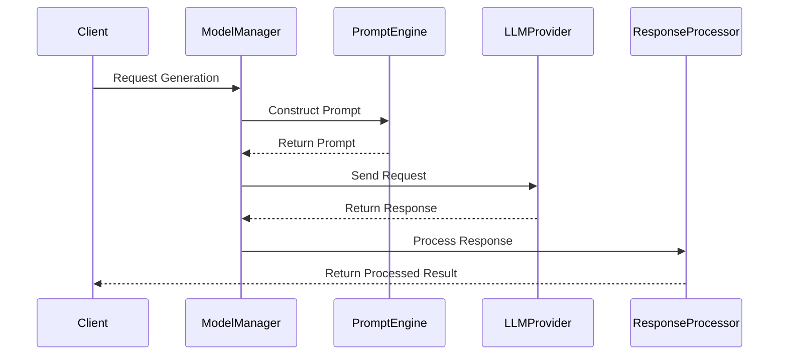
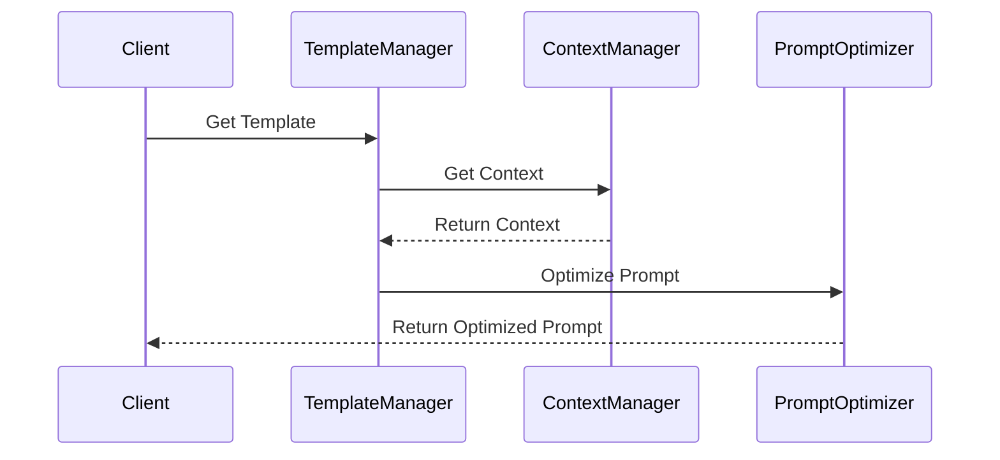
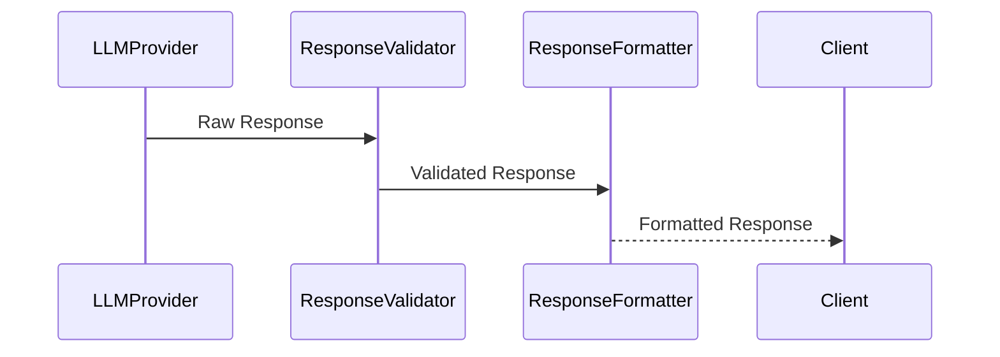

# LLM Integration Flows

This document details the flows related to Large Language Model (LLM) integration in the NeuralFlow system.

## Model Interaction Flow

### Purpose
Manages interactions with various LLM providers, handling prompt construction, model calls, and response processing.

### Components
1. **ModelManager**
   - Manages model configurations
   - Handles model selection
   - Monitors model performance

2. **PromptEngine**
   - Constructs prompts
   - Manages prompt templates
   - Handles context injection

3. **ResponseProcessor**
   - Processes model responses
   - Handles response validation
   - Manages response formatting

### Flow Sequence



### Configuration

```yaml
llm_integration:
  model_manager:
    default_provider: "openai"
    model_configs:
      gpt4:
        model: "gpt-4"
        temperature: 0.7
        max_tokens: 2048
      gpt35:
        model: "gpt-3.5-turbo"
        temperature: 0.8
        max_tokens: 1024
  
  prompt_engine:
    template_dir: "templates/"
    max_context_length: 4096
    optimization: true
```

## Prompt Management Flow

### Purpose
Handles the creation, management, and optimization of prompts for different use cases.

### Components
1. **TemplateManager**
   - Manages prompt templates
   - Handles template versioning
   - Provides template validation

2. **ContextManager**
   - Manages context injection
   - Handles context optimization
   - Manages context windows

### Flow Sequence



### Template Structure

```yaml
template:
  name: "code_generation"
  version: "1.0"
  description: "Template for code generation tasks"
  content: |
    System: You are a helpful coding assistant.
    Context: {context}
    User: {user_input}
    Assistant: Let me help you with that.
  
  parameters:
    - name: "context"
      type: "string"
      required: true
    - name: "user_input"
      type: "string"
      required: true
```

## Response Processing Flow

### Purpose
Processes and validates responses from LLM models, ensuring they meet requirements and are properly formatted.

### Components
1. **ResponseValidator**
   - Validates response format
   - Checks response quality
   - Ensures response completeness

2. **ResponseFormatter**
   - Formats responses
   - Handles response transformation
   - Manages response structure

### Flow Sequence



### Validation Rules

```python
class ResponseValidation:
    async def validate_response(self, response: LLMResponse) -> bool:
        """
        Validates LLM response against defined rules.
        """
        rules = [
            self.check_completion(response),
            self.check_format(response),
            self.check_content_safety(response),
            self.check_length(response)
        ]
        return all(await asyncio.gather(*rules))
```

## Error Handling

### 1. Model Errors

```python
async def handle_model_error(self, error: ModelError) -> Result:
    """
    Handles errors during model interaction.
    """
    try:
        if isinstance(error, TokenLimitError):
            return await self.handle_token_limit()
        elif isinstance(error, ModelTimeoutError):
            return await self.handle_timeout()
        elif isinstance(error, ModelUnavailableError):
            return await self.fallback_model()
    except Exception as e:
        await self.log_error(e)
        return ErrorResult(str(e))
```

### 2. Prompt Errors

```python
async def handle_prompt_error(self, error: PromptError) -> Result:
    """
    Handles errors in prompt construction or validation.
    """
    if isinstance(error, ContextTooLongError):
        return await self.optimize_context()
    elif isinstance(error, TemplateError):
        return await self.use_fallback_template()
    return ErrorResult(str(error))
```

## Performance Optimization

### 1. Context Window Optimization

```python
async def optimize_context(self, context: str, max_tokens: int) -> str:
    """
    Optimizes context to fit within token limits.
    """
    if len(context) > max_tokens:
        return await self.summarize_context(context, max_tokens)
    return context
```

### 2. Caching

```python
class ResponseCache:
    async def get_cached_response(
        self,
        prompt: str,
        params: Dict
    ) -> Optional[Response]:
        """
        Retrieves cached response if available.
        """
        cache_key = self.generate_cache_key(prompt, params)
        return await self.cache.get(cache_key)
```

## Monitoring and Metrics

### 1. Performance Metrics

```python
class LLMMetrics:
    async def record_metrics(self, interaction: ModelInteraction):
        """
        Records metrics for model interaction.
        """
        metrics = {
            'latency': interaction.duration,
            'tokens_used': interaction.token_count,
            'model': interaction.model_name,
            'success': interaction.success
        }
        await self.metrics_client.record(metrics)
```

### 2. Quality Monitoring

```python
class QualityMonitor:
    async def monitor_response_quality(
        self,
        response: Response,
        feedback: Optional[Feedback]
    ):
        """
        Monitors response quality metrics.
        """
        quality_metrics = {
            'relevance': await self.measure_relevance(response),
            'coherence': await self.measure_coherence(response),
            'user_feedback': feedback
        }
        await self.quality_metrics.record(quality_metrics)
```

## Security Considerations

### 1. Input Sanitization

```python
async def sanitize_input(self, user_input: str) -> str:
    """
    Sanitizes user input before sending to LLM.
    """
    sanitized = await self.remove_sensitive_data(user_input)
    sanitized = await self.validate_input_format(sanitized)
    return sanitized
```

### 2. Output Validation

```python
async def validate_output(self, response: str) -> bool:
    """
    Validates model output for security concerns.
    """
    checks = [
        self.check_for_sensitive_data(response),
        self.validate_output_format(response),
        self.check_content_safety(response)
    ]
    return all(await asyncio.gather(*checks))
```

## Best Practices

1. **Prompt Engineering**
   - Use clear and specific instructions
   - Include relevant context
   - Maintain consistent format
   - Version control templates

2. **Error Handling**
   - Implement proper fallbacks
   - Handle rate limits gracefully
   - Monitor error rates
   - Log error details

3. **Performance**
   - Optimize context windows
   - Implement caching
   - Monitor token usage
   - Track response times

4. **Security**
   - Sanitize inputs
   - Validate outputs
   - Handle sensitive data
   - Monitor for abuse

## Testing Guidelines

### 1. Unit Tests

```python
async def test_prompt_construction():
    template = PromptTemplate("test_template")
    prompt = await template.construct({"context": "test"})
    assert prompt.is_valid()
```

### 2. Integration Tests

```python
async def test_model_interaction():
    manager = ModelManager()
    response = await manager.generate("test prompt")
    assert response.status == Status.SUCCESS
```

## Contributing

When contributing to LLM integration:

1. Follow prompt engineering guidelines
2. Update template documentation
3. Add appropriate tests
4. Consider security implications
5. Update metrics collection 