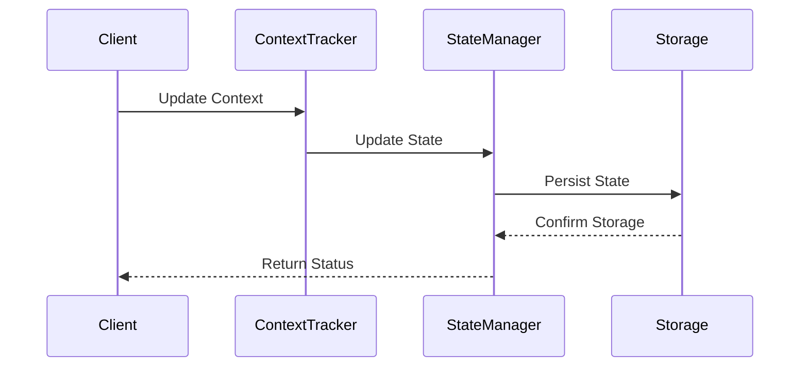
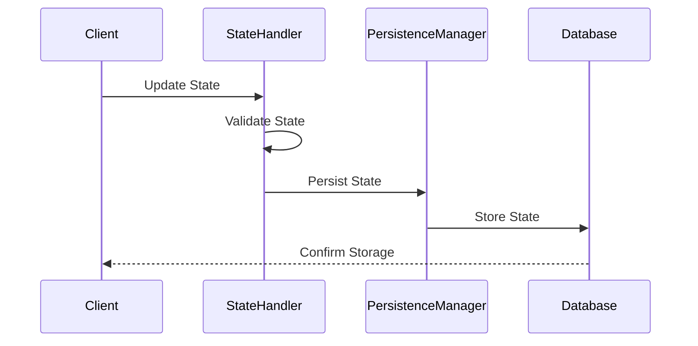
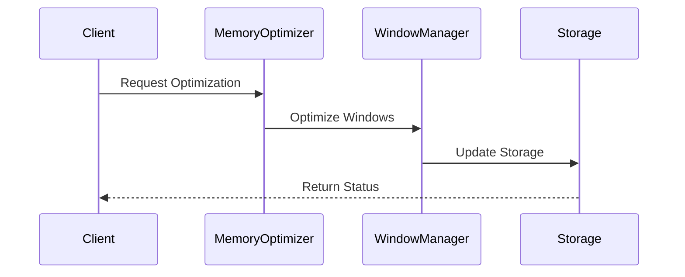

# Memory Management Flows

This document details the flows related to memory management in the NeuralFlow system.

## Context Tracking Flow

### Purpose
Manages the tracking and maintenance of conversation context and state throughout the system.

### Components
1. **ContextTracker**
   - Tracks conversation state
   - Manages context windows
   - Handles context updates

2. **StateManager**
   - Manages conversation state
   - Handles state persistence
   - Manages state transitions

### Flow Sequence



### Configuration

```yaml
memory_management:
  context_tracker:
    max_context_length: 4096
    context_overlap: 128
    expiry_time: 3600
  
  state_manager:
    persistence: true
    max_states: 100
    cleanup_interval: 300
```

## State Management Flow

### Purpose
Handles the management of conversation and system states, including persistence and recovery.

### Components
1. **StateHandler**
   - Manages state transitions
   - Handles state validation
   - Manages state history

2. **PersistenceManager**
   - Handles state persistence
   - Manages state recovery
   - Handles state cleanup

### Flow Sequence



### Implementation

```python
class StateManager:
    async def update_state(
        self,
        session_id: str,
        new_state: State
    ) -> StateUpdateResult:
        """
        Updates conversation state.
        """
        # Validate state
        if not await self.validate_state(new_state):
            raise InvalidStateError("Invalid state transition")
        
        # Update state
        current_state = await self.get_current_state(session_id)
        updated_state = await self.merge_states(current_state, new_state)
        
        # Persist state
        return await self.persist_state(session_id, updated_state)
```

## Memory Optimization Flow

### Purpose
Optimizes memory usage and context windows for efficient processing and storage.

### Components
1. **MemoryOptimizer**
   - Optimizes memory usage
   - Manages context windows
   - Handles memory cleanup

2. **WindowManager**
   - Manages context windows
   - Handles window sliding
   - Optimizes window size

### Flow Sequence



### Implementation

```python
class MemoryOptimizer:
    async def optimize_memory(
        self,
        session_id: str,
        max_size: int
    ) -> OptimizationResult:
        """
        Optimizes memory usage for a session.
        """
        # Get current memory usage
        current_usage = await self.get_memory_usage(session_id)
        
        # Check if optimization needed
        if current_usage > max_size:
            return await self.perform_optimization(session_id, max_size)
        
        return OptimizationResult(needed=False)
```

## Context Window Management

### 1. Window Sliding

```python
class WindowManager:
    async def slide_window(
        self,
        context: Context,
        new_content: str
    ) -> Context:
        """
        Slides context window to accommodate new content.
        """
        # Calculate new window
        new_window = await self.calculate_window(
            context,
            new_content
        )
        
        # Update context
        return await self.update_context(new_window)
```

### 2. Window Optimization

```python
class WindowOptimizer:
    async def optimize_window(
        self,
        window: Window,
        max_tokens: int
    ) -> Window:
        """
        Optimizes context window size.
        """
        if window.token_count > max_tokens:
            return await self.truncate_window(window, max_tokens)
        return window
```

## Error Handling

### 1. State Errors

```python
async def handle_state_error(
    self,
    error: StateError
) -> StateResult:
    """
    Handles errors in state management.
    """
    if isinstance(error, StateTransitionError):
        return await self.handle_transition_error(error)
    elif isinstance(error, StatePersistenceError):
        return await self.handle_persistence_error(error)
    return ErrorResult(str(error))
```

### 2. Memory Errors

```python
async def handle_memory_error(
    self,
    error: MemoryError
) -> MemoryResult:
    """
    Handles memory-related errors.
    """
    if isinstance(error, MemoryOverflowError):
        return await self.handle_overflow(error)
    elif isinstance(error, ContextWindowError):
        return await self.handle_window_error(error)
    return ErrorResult(str(error))
```

## Performance Optimization

### 1. Memory Usage

```python
class MemoryUsageOptimizer:
    async def optimize_usage(
        self,
        current_usage: int,
        target_usage: int
    ) -> OptimizationResult:
        """
        Optimizes memory usage.
        """
        if current_usage > target_usage:
            return await self.reduce_memory_usage(
                current_usage,
                target_usage
            )
        return OptimizationResult(needed=False)
```

### 2. Context Optimization

```python
class ContextOptimizer:
    async def optimize_context(
        self,
        context: Context,
        max_size: int
    ) -> Context:
        """
        Optimizes context size and relevance.
        """
        # Remove irrelevant content
        cleaned = await self.remove_irrelevant(context)
        
        # Compress if needed
        if len(cleaned) > max_size:
            return await self.compress_context(cleaned, max_size)
        
        return cleaned
```

## Monitoring and Metrics

### 1. Memory Metrics

```python
class MemoryMetrics:
    async def record_memory_metrics(
        self,
        session_id: str
    ):
        """
        Records memory usage metrics.
        """
        metrics = {
            'memory_used': await self.get_memory_usage(session_id),
            'context_size': await self.get_context_size(session_id),
            'state_count': await self.get_state_count(session_id)
        }
        await self.metrics_client.record(metrics)
```

### 2. Performance Monitoring

```python
class PerformanceMonitor:
    async def monitor_performance(
        self,
        operation: Operation
    ):
        """
        Monitors memory operation performance.
        """
        metrics = {
            'operation_type': operation.type,
            'duration': operation.duration,
            'memory_impact': operation.memory_delta
        }
        await self.monitor.record(metrics)
```

## Security Considerations

### 1. Data Protection

```python
class MemoryProtection:
    async def protect_sensitive_data(
        self,
        context: Context
    ) -> Context:
        """
        Protects sensitive data in memory.
        """
        # Identify sensitive data
        sensitive = await self.identify_sensitive_data(context)
        
        # Apply protection
        return await self.apply_protection(context, sensitive)
```

### 2. Access Control

```python
class MemoryAccess:
    async def check_access(
        self,
        user: User,
        context: Context
    ) -> bool:
        """
        Checks access permissions for memory operations.
        """
        return await self.auth_manager.has_permission(
            user,
            context.required_permissions
        )
```

## Best Practices

1. **Context Management**
   - Optimize context windows
   - Remove irrelevant content
   - Maintain context coherence
   - Handle context overflow

2. **State Management**
   - Validate state transitions
   - Persist critical states
   - Handle recovery gracefully
   - Maintain state history

3. **Memory Optimization**
   - Monitor memory usage
   - Implement cleanup routines
   - Optimize storage format
   - Handle memory pressure

4. **Security**
   - Protect sensitive data
   - Implement access control
   - Secure state persistence
   - Audit memory access

## Testing Guidelines

### 1. Unit Tests

```python
async def test_context_management():
    manager = ContextManager()
    context = await manager.update_context(test_input)
    assert context.is_valid()
    assert len(context) <= max_context_size
```

### 2. Integration Tests

```python
async def test_memory_flow():
    memory = MemoryManager()
    result = await memory.process_operation(test_operation)
    assert result.status == Status.SUCCESS
    assert result.memory_usage <= max_memory
```

## Contributing

When contributing to memory management:

1. Follow optimization guidelines
2. Update documentation
3. Add appropriate tests
4. Consider security implications
5. Update monitoring metrics 