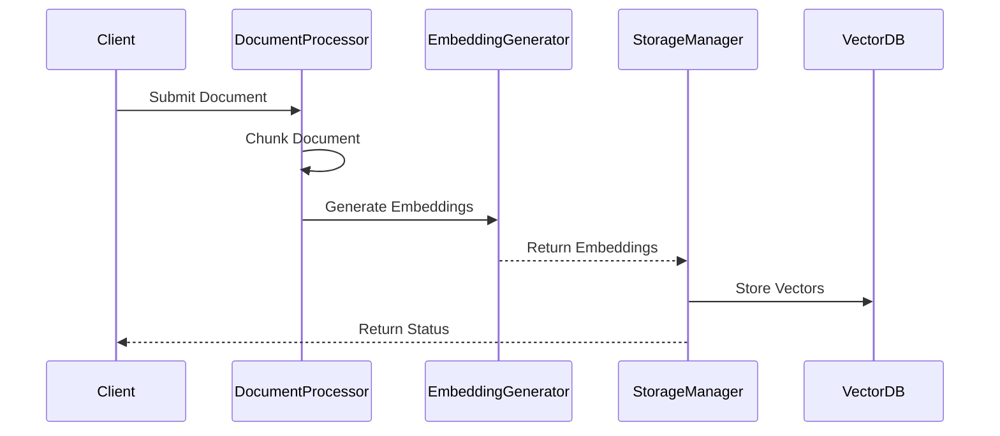
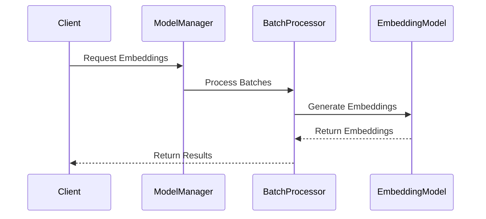
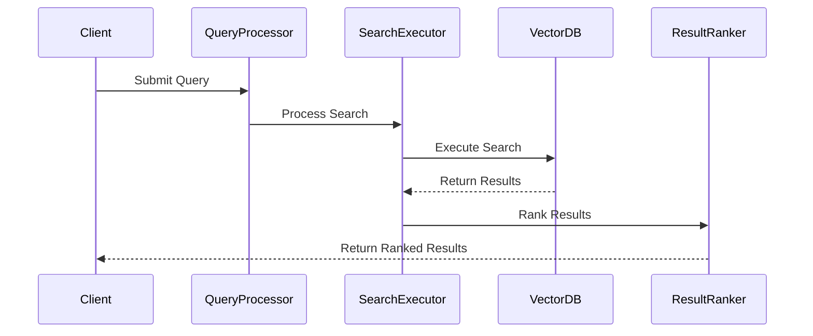
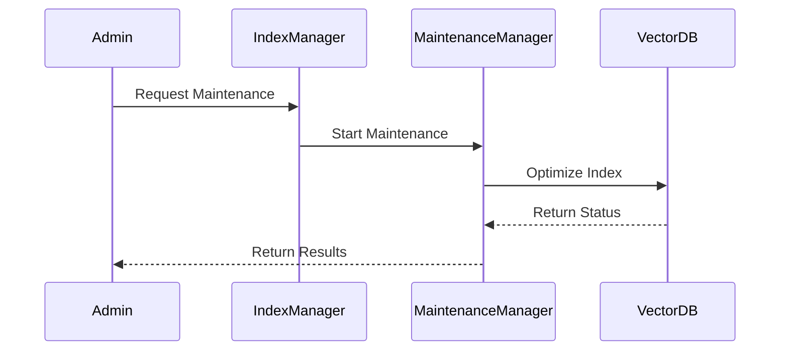

# Vector Store Flows

This document details the flows related to vector store operations in the NeuralFlow system.

## Document Processing Flow

### Purpose
Handles the processing of documents for vector storage, including chunking, embedding generation, and storage operations.

### Components
1. **DocumentProcessor**
   - Handles document parsing
   - Manages document chunking
   - Processes metadata

2. **EmbeddingGenerator**
   - Generates embeddings
   - Manages embedding models
   - Handles batch processing

3. **StorageManager**
   - Manages vector storage
   - Handles index operations
   - Manages metadata storage

### Flow Sequence



### Configuration

```yaml
vector_store:
  document_processor:
    chunk_size: 512
    overlap: 50
    max_chunks: 1000
  
  embedding_generator:
    model: "all-mpnet-base-v2"
    batch_size: 32
    dimension: 768
  
  storage:
    backend: "faiss"
    index_type: "IVFFlat"
    metric: "cosine"
```

## Embedding Generation Flow

### Purpose
Manages the generation of embeddings from processed documents and handles optimization of the embedding process.

### Components
1. **ModelManager**
   - Manages embedding models
   - Handles model loading
   - Monitors performance

2. **BatchProcessor**
   - Manages batch processing
   - Optimizes batch size
   - Handles memory usage

### Flow Sequence



### Implementation

```python
class EmbeddingGenerator:
    async def generate_embeddings(
        self,
        texts: List[str],
        batch_size: int = 32
    ) -> List[np.ndarray]:
        """
        Generates embeddings for a list of texts.
        """
        batches = self.create_batches(texts, batch_size)
        embeddings = []
        
        for batch in batches:
            batch_embeddings = await self.process_batch(batch)
            embeddings.extend(batch_embeddings)
        
        return embeddings
```

## Similarity Search Flow

### Purpose
Handles similarity search operations in the vector store, including query processing and result ranking.

### Components
1. **QueryProcessor**
   - Processes search queries
   - Generates query embeddings
   - Optimizes search parameters

2. **SearchExecutor**
   - Executes vector search
   - Manages search algorithms
   - Handles result ranking

### Flow Sequence



### Implementation

```python
class SimilaritySearch:
    async def search(
        self,
        query: str,
        k: int = 5,
        threshold: float = 0.7
    ) -> List[SearchResult]:
        """
        Performs similarity search for a query.
        """
        # Generate query embedding
        query_embedding = await self.generate_query_embedding(query)
        
        # Execute search
        results = await self.vector_db.search(
            query_embedding,
            k=k,
            threshold=threshold
        )
        
        # Rank and format results
        return await self.rank_results(results)
```

## Index Management Flow

### Purpose
Manages vector store indices, including creation, updates, and optimization operations.

### Components
1. **IndexManager**
   - Manages index operations
   - Handles index updates
   - Optimizes index structure

2. **MaintenanceManager**
   - Handles index maintenance
   - Manages garbage collection
   - Optimizes performance

### Flow Sequence



### Implementation

```python
class IndexManager:
    async def optimize_index(self) -> IndexStatus:
        """
        Optimizes the vector store index.
        """
        # Analyze index
        stats = await self.analyze_index()
        
        # Perform optimization
        if stats.needs_optimization:
            await self.perform_optimization()
        
        # Verify optimization
        return await self.verify_index()
```

## Error Handling

### 1. Document Processing Errors

```python
async def handle_processing_error(
    self,
    error: ProcessingError
) -> ProcessingResult:
    """
    Handles errors during document processing.
    """
    if isinstance(error, ChunkingError):
        return await self.handle_chunking_error(error)
    elif isinstance(error, EmbeddingError):
        return await self.handle_embedding_error(error)
    return ErrorResult(str(error))
```

### 2. Storage Errors

```python
async def handle_storage_error(
    self,
    error: StorageError
) -> StorageResult:
    """
    Handles errors during vector storage operations.
    """
    if isinstance(error, IndexError):
        return await self.handle_index_error(error)
    elif isinstance(error, CapacityError):
        return await self.handle_capacity_error(error)
    return ErrorResult(str(error))
```

## Performance Optimization

### 1. Batch Processing

```python
class BatchOptimizer:
    async def optimize_batch_size(
        self,
        data_size: int,
        memory_limit: int
    ) -> int:
        """
        Optimizes batch size based on available resources.
        """
        return min(
            self.calculate_optimal_batch(data_size),
            self.calculate_memory_batch(memory_limit)
        )
```

### 2. Index Optimization

```python
class IndexOptimizer:
    async def optimize_index_structure(
        self,
        index_stats: IndexStats
    ) -> OptimizationResult:
        """
        Optimizes index structure for better performance.
        """
        if index_stats.size > self.config.reindex_threshold:
            return await self.reindex()
        return await self.incremental_optimize()
```

## Monitoring and Metrics

### 1. Performance Metrics

```python
class VectorStoreMetrics:
    async def record_operation_metrics(
        self,
        operation: Operation
    ):
        """
        Records metrics for vector store operations.
        """
        metrics = {
            'operation_type': operation.type,
            'duration': operation.duration,
            'vectors_processed': operation.vector_count,
            'memory_used': operation.memory_usage
        }
        await self.metrics_client.record(metrics)
```

### 2. Health Monitoring

```python
class HealthMonitor:
    async def check_store_health(self) -> HealthStatus:
        """
        Monitors vector store health metrics.
        """
        checks = [
            self.check_index_health(),
            self.check_storage_capacity(),
            self.check_performance_metrics()
        ]
        return HealthStatus(await asyncio.gather(*checks))
```

## Security Considerations

### 1. Access Control

```python
class VectorStoreAuth:
    async def check_operation_permission(
        self,
        user: User,
        operation: Operation
    ) -> bool:
        """
        Checks permissions for vector store operations.
        """
        return await self.auth_manager.has_permission(
            user,
            operation.required_permissions
        )
```

### 2. Data Protection

```python
class DataProtection:
    async def protect_sensitive_data(
        self,
        vectors: List[Vector]
    ) -> List[Vector]:
        """
        Applies data protection measures to vectors.
        """
        return [
            await self.encrypt_vector(vector)
            for vector in vectors
        ]
```

## Best Practices

1. **Document Processing**
   - Validate input documents
   - Optimize chunk size
   - Handle large documents efficiently
   - Preserve document metadata

2. **Embedding Generation**
   - Use appropriate models
   - Optimize batch processing
   - Monitor resource usage
   - Cache common embeddings

3. **Search Operations**
   - Optimize search parameters
   - Implement proper ranking
   - Cache frequent queries
   - Monitor search performance

4. **Index Management**
   - Regular maintenance
   - Monitor index health
   - Optimize for workload
   - Backup critical indices

## Testing Guidelines

### 1. Unit Tests

```python
async def test_document_processing():
    processor = DocumentProcessor()
    result = await processor.process_document(test_doc)
    assert result.chunks == expected_chunks
```

### 2. Integration Tests

```python
async def test_search_flow():
    search = SimilaritySearch()
    results = await search.search("test query")
    assert len(results) > 0
    assert all(r.score >= 0.7 for r in results)
```

## Contributing

When contributing to vector store functionality:

1. Follow performance guidelines
2. Update documentation
3. Add appropriate tests
4. Consider security implications
5. Update monitoring metrics 